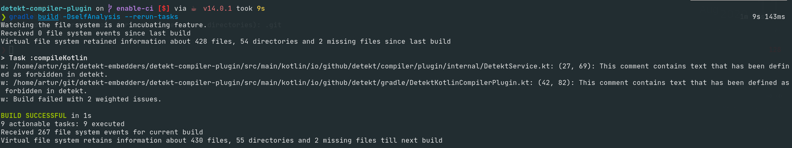

# WIP: __detekt-compiler-plugin__


[](https://plugins.gradle.org/plugin/io.github.detekt.gradle.compiler-plugin)

Experimental support for integrating detekt as a Kotlin compiler plugin




### Usage

```kotlin
plugins {
    id("io.github.detekt.gradle.compiler-plugin") version "<latest>"
}

detekt {
    isEnabled = true // or with a property: System.getProperty("runDetekt") != null
    // everything from https://detekt.github.io/detekt/kotlindsl.html#options-for-detekt-configuration-closure
    // is supported to declare, only some options are used. See limitations. 
}
```

detekt plugins can be added to your project using the `detektPlugins` configuration:

```kotlin
dependencies {
    detektPlugins("io.gitlab.arturbosch.detekt:detekt-formatting:<version>")
}
```

Reports can be customized using the `detekt` extension which is added to `KotlinCompile` tasks. Using Groovy this might
look like:

```groovy
tasks.withType(org.jetbrains.kotlin.gradle.tasks.KotlinCompile).configureEach {
    detekt {
        reports {
            xml.enabled.set(true)
            txt.enabled.set(false)
            create("custom") {
                enabled.set(false)
            }
        }
    }
}
```

### Limitations

Everything our Gradle plugin (`DetektExtension`) supports, is also supported on the declaration side with this plugin.  
However only the following options are implemented/passed down to detekt:
- config
- baseline
- debug
- buildUponDefaultConfig
